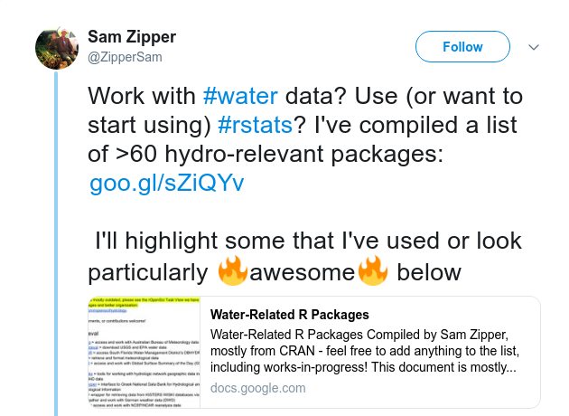
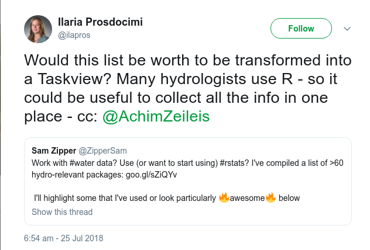
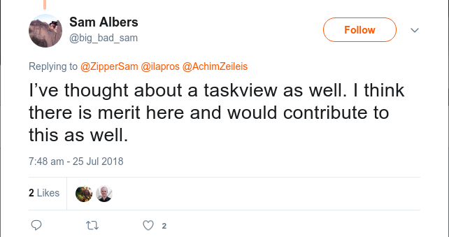
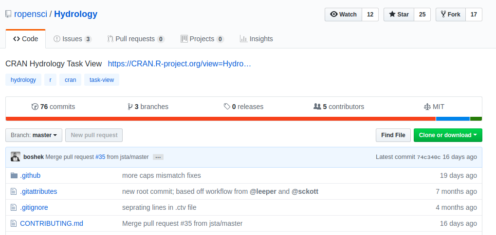
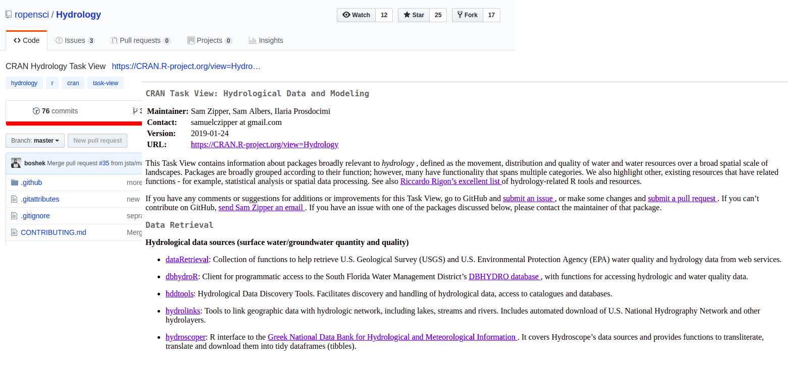

```{r setup, include=FALSE}
options(htmltools.dir.version = FALSE)

# color used in xaringanthemer
egu_blue <- rgb(red = 0, green = 112, blue = 192,maxColorValue = 255)
egu_yellow <- rgb(red = 255, green = 221, blue = 0,maxColorValue = 255)

# color used for font awesome icons
fa_color <- "lightgrey"

# SET XARINGTHEMER CHUNK TO EVAL = TRUE TO CHANGE THEME!
# xaringanthemer saves the resulting css theme in the main document directory.
# drop the 'statics/css/'  from the file path to use the new css file


# intsall missing packages
list.of.packages <- c("xaringan", "xaringanthemer", "emo", "fontawesome")
new.packages <- list.of.packages[!(list.of.packages %in% installed.packages()[,"Package"])]
if(length(new.packages)) install.packages(new.packages)

```


class: title-slide, left, middle

<h1> Introduction <br> and <br> 
Getting to grips with R in hydrology </h1>

<br>


<h4> Alexander Hurley </h4>
.small[`r fontawesome::fa("home", fill = fa_color)` [aglhurley.rbind.io](https://aglhurley.rbind.io)  
`r fontawesome::fa("twitter", fill = fa_color)` [aglhurley](https://twitter.com/aglhurley)]

<!-- <h4> Claudia Vitolo </h4> -->
<!-- .small[`r fontawesome::fa("home", fill = fa_color)` [aquaresearcher.wordpress.com](https://aquaresearcher.wordpress.com)   -->
<!-- `r fontawesome::fa("twitter", fill = fa_color)` [clavitolo](https://twitter.com/clavitolo)] -->

<h4> Ilaria Prosdocimi </h4>
.small[`r fontawesome::fa("home", fill = fa_color)` [https://github.com/ilapros](https://github.com/ilapros)  
`r fontawesome::fa("twitter", fill = fa_color)` [ilapros](https://twitter.com/ilapros)]

.title-logo-box[]

---
class: inverse, center, middle

##  Intro to:  
# Using R in Hydrology Short Course
## (SC1.44 / HS12.5)

---

# Session Organization

--

*No need to follow on your computer - just listen.* `r fontawesome::fa("headphones", fill = egu_yellow)`

<br>


All materials (and additional info) available on: 


[GitHub: github.com/hydrosoc/rhydro_EGU19/](https://github.com/hydrosoc/rhydro_EGU19/)

<br>

--


Feel free to take pictures! `r fontawesome::fa("camera", fill = egu_yellow)`

---

# Session Organization


- **16:15-16:20**:  <font size="-0.5"> Welcome and introduction </font>
- **16:20-16:25**:  <font size="-0.5"> Getting to grips with R in hydrology </font>


- **16:25-16:40**:  <font size="-0.5"> Obtaining, cleaning and visualizing hydrological data </font>
- **16:40-16:55**:  <font size="-0.5"> Parallel and HPC computing for hydrologists </font>


- **16:55-17:00**:  <font size="-0.5"> Question time (#1) </font>


- **17:00-17:15**:  <font size="-0.5"> Staying up-to date: automating tasks from downloading data to reporting </font>
- **17:15-17:30**:  <font size="-0.5"> Developing apps for data exploration & analyses - a UK drought story </font>
- **17:30-17:45**:  <font size="-0.5"> Modelling the hydrological cycle in snow-dominated catchments </font>


- **17:45-17:50**:  <font size="-0.5"> Question time (#2) </font>


- **17:50-18:00**:  <font size="-0.5"> Closing remarks (community initiatives, future of R / new developments) </font>

---


# Session Organization

- **16:15-16:20**:  <font size="-0.5"> Welcome and introduction </font>
- **16:20-16:25**:  <font size="-0.5", color = "blue"> Getting to grips with R in hydrology </font>


- **16:25-16:40**:  <font size="-0.5", color = "blue"> Obtaining, cleaning and visualizing hydrological data </font>
- **16:40-16:55**:  <font size="-0.5", color = "blue"> Parallel and HPC computing for hydrologists </font>


- **16:55-17:00**:  <font size="-0.5"> Question time (#1) </font>


- **17:00-17:15**:  <font size="-0.5", color = "blue"> Staying up-to date: automating tasks from downloading data to reporting </font>
- **17:15-17:30**:  <font size="-0.5"> Developing apps for data exploration & analyses - a UK drought story </font>
- **17:30-17:45**:  <font size="-0.5"> Modelling the hydrological cycle in snow-dominated catchments </font>


- **17:45-17:50**:  <font size="-0.5"> Question time (#2) </font>


- **17:50-18:00**:  <font size="-0.5"> Closing remarks (community initiatives, future of R / new developments) </font>

<br>
**General application of R and work flows for hydrology**

---

# Session Organization

- **16:15-16:20**:  <font size="-0.5"> Welcome and introduction </font>
- **16:20-16:25**:  <font size="-0.5"> Getting to grips with R in hydrology </font>


- **16:25-16:40**:  <font size="-0.5"> Obtaining, cleaning and visualizing hydrological data </font>
- **16:40-16:55**:  <font size="-0.5"> Parallel and HPC computing for hydrologists </font>


- **16:55-17:00**:  <font size="-0.5"> Question time (#1) </font>


- **17:00-17:15**:  <font size="-0.5"> Staying up-to date: automating tasks from downloading data to reporting </font>
- **17:15-17:30**:  <font size="-0.5", color = "blue"> Developing apps for data exploration & analyses - a UK drought story </font>
- **17:30-17:45**:  <font size="-0.5", color = "blue"> Modelling the hydrological cycle in snow-dominated catchments </font>


- **17:45-17:50**:  <font size="-0.5"> Question time (#2) </font>


- **17:50-18:00**:  <font size="-0.5"> Closing remarks (community initiatives, future of R / new developments) </font>

<br>
**Domain-specific use-cases**

---

# Session Organization


- **16:15-16:20**:  <font size="-0.5"> Welcome and introduction </font>
- **16:20-16:25**:  <font size="-0.5"> Getting to grips with R in hydrology </font>


- **16:25-16:40**:  <font size="-0.5"> Obtaining, cleaning and visualizing hydrological data </font>
- **16:40-16:55**:  <font size="-0.5"> Parallel and HPC computing for hydrologists </font>


- **16:55-17:00**:  <font size="-0.5", color = "red"> Question time (#1) </font>


- **17:00-17:15**:  <font size="-0.5"> Staying up-to date: automating tasks from downloading data to reporting </font>
- **17:15-17:30**:  <font size="-0.5"> Developing apps for data exploration & analyses - a UK drought story </font>
- **17:30-17:45**:  <font size="-0.5"> Modelling the hydrological cycle in snow-dominated catchments </font>


- **17:45-17:50**:  <font size="-0.5", color = "red"> Question time (#2) </font>


- **17:50-18:00**:  <font size="-0.5"> Closing remarks (community initiatives, future of R / new developments) </font>

---
class: center, middle


### Questions?
### **Go to:** [www.sli.do](www.sli.do) and
## enter event code **#rhydro2019**


---
class: inverse, center, middle

#  Getting to grips with R in hydrology


---

# Using R - some resources 

<!-- R is a language for statistical computing - now evolved to a more complex programming language.  -->
R is ubiquitous in science and many other fields: lots of material/blogposts introducing R for all sorts of applications and data. 


Some popular material (see also the suggestions at [RStudio](https://www.rstudio.com/online-learning/)):   

* [Software carpentry:](http://swcarpentry.github.io/r-novice-inflammation/) a set of introductory lessons - see also the other carpentry lessons/workshops near you 

* [An Introduction to R](https://cran.r-project.org/doc/manuals/r-release/R-intro.html) by the R Development Core Team

* [R for data science](https://r4ds.had.co.nz/) by Garrett Grolemund and Hadley Wickham

* [Stat 454:](http://stat545.com/topics.html) UBC course on Data wrangling, exploration, and analysis with R

* Packages vignettes

* Meet-ups, R User Groups, R-Ladies... 

* [R-bloggers](https://www.r-bloggers.com/), [Stackoverflow](https://stackoverflow.com/questions/tagged/r), Twitter (#rstats), [RWeekly](https://rweekly.org/)...

---

# Using R for hydrolgy - some resources

* [CRAN Hydrology Taskview:](https://cran.r-project.org/web/views/Hydrology.html) a curated list of packages useful for all water-related investigations (and links to the Spatial/Environmetrics TV)

* [USGS-R:](https://owi.usgs.gov/R) a community of support for users of R

* [Riccardo Rigon's blogpost:](https://abouthydrology.blogspot.com/2012/08/r-resources-for-hydrologists.html) a list of tools useful to hydrologists

* Past [EGU courses](https://github.com/hydrosoc) and Facebook Group (Hydrology in R)

* HESS [Discussion paper](https://www.hydrol-earth-syst-sci-discuss.net/hess-2019-50/hess-2019-50.pdf)

* [R-bloggers](https://www.r-bloggers.com/), [Stackoverflow](https://stackoverflow.com/questions/tagged/r), Twitter (#rstats)... 


---

# Origin of the Hydrology Taskview 

```{r, out.width=700,eval=TRUE, echo=FALSE}
 
```   

---

# Origin of the Hydrology Taskview 

```{r, fig.width=8,fig.asp=0.6,eval=TRUE, echo=FALSE}
 
```   

---

# Origin of the Hydrology Taskview 


```{r, fig.width=8,fig.asp=0.6,eval=TRUE, echo=FALSE}
 
```   


---

# From Talk to Action

```{r, fig.width=8,fig.asp=0.6,eval=TRUE, echo=FALSE}
 
```   

---

# From Talk to Action

```{r, fig.width=8,fig.asp=0.6,eval=TRUE, echo=FALSE}
 
```   


