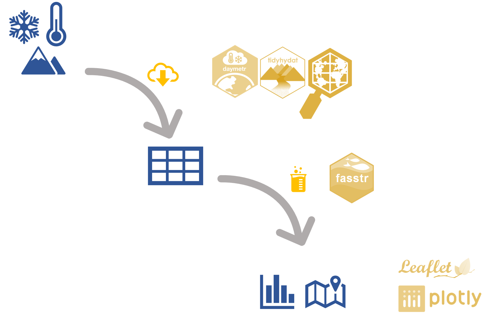
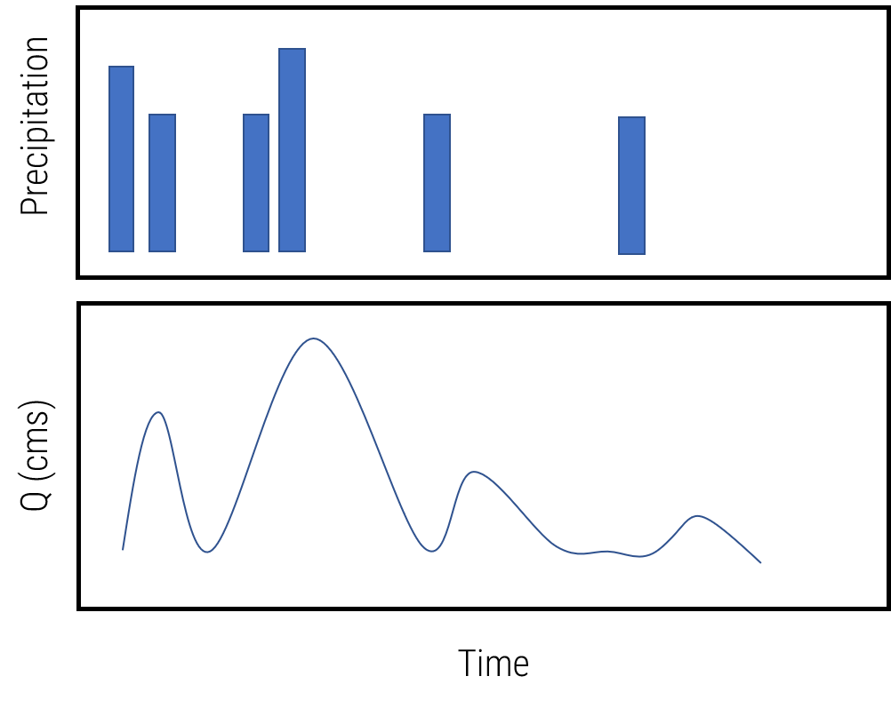

```{r setup, include=FALSE}
options(htmltools.dir.version = FALSE)
knitr::opts_chunk$set(fig.retina = 3, warning = FALSE, message = FALSE)


```


```{r presi-setup, include=FALSE}


# color used in xaringanthemer
egu_blue <- rgb(red = 0, green = 112, blue = 192,maxColorValue = 255)
egu_yellow <- rgb(red = 255, green = 221, blue = 0,maxColorValue = 255)

# color used for font awesome icons
fa_color <- "lightgrey"


```


class: title-slide, left, middle

<h1> Obtaining, cleaning and visualizing <br> 
hydrological data with `r fontawesome::fa("r-project", fill = egu_yellow)` </h1>

<br>


<h3> Alex Hurley <br> 
<em>University of Birmingham</em> 
</h3>
<br>
<br>
.small[`r fontawesome::fa("home", fill = fa_color)` [aglhurley.rbind.io](https://aglhurley.rbind.io)  
`r fontawesome::fa("twitter", fill = fa_color)` [aglhurley](https://twitter.com/aglhurley)]


.title-logo-box[]


---

# Goals

--


.middle[
- `r fontawesome::fa("cube", fill = egu_yellow)` Introduce **useful packages** 

- `r fontawesome::fa("handshake", fill = egu_yellow)` Highlight synergies

- `r fontawesome::fa("retweet", fill = egu_yellow)` Showcase capabilities (**processing**, **stats**)

-  `r fontawesome::fa("chart-area", fill = egu_yellow)` Visualize (**static** and **interacive** graphs)]

---

# Approach


- Download **hydrometric** and **ancillary** (gridded) data for stations defined with `AOI` in Glacier National Park (BC, Canada)

- Calculate *P-pET* (`raster`), *Runoff*, and flow statistics (`fasstr`)

- Visualize results (P-pET vs. R, interactive flow stats)

.center[]


---

layout: false
class: inverse, center, middle

# Get Started

---

# Set-up: packages and utils


```{r eval=FALSE, tidy=FALSE}

install.packages("devtools")

# hydro and met
devtools::install_github("bcgov/fasstr")
install.packages("daymetr")
install.packages("tidyhydat")

# spatial
devtools::install_github("mikejohnson51/AOI")
install.packages("rgeos")
install.packages("raster")
install.packages("leaflet")

# general purpose and viz
install.packages("dplyr")
install.packages("purrr")
install.packages("ggplot2")
install.packages("plotly")
install.packages("DT")

```

--

- Relevant packages loaded when necessary 
- Typically use `package::function()` for clarity


```{r pck, include=FALSE}

library(dplyr)
source("./03_get-clean-viz_files/src/02_pub.R")

```


---

class: inverse, center, middle

# A: Define area of interest


---

# Define area

- use `AOI` to define bounding box around Glacier National Park  
(100 by 100 km)

```{r define-area, message = FALSE}
# Specify Regions and have a peak
rockies <- AOI::getAOI(clip = list("Glacier National Park Canada", 
                                   100,
                                   100),
                       km = TRUE)

class(rockies) 

```

- `rockies@bbox` useful for other functions!

---

layout: true

# Define area

---

```{r leaflet-code, eval=require('leaflet'), message = FALSE, eval = FALSE}
library(dplyr)
library(leaflet)


rockies %>% AOI::check()


```
  
---


```{r leaflet-plot, eval=require('leaflet'), echo = FALSE, message = FALSE, eval = TRUE}
library(dplyr)
library(leaflet)


rockies %>% AOI::check()


```
  
---

layout:false 

class: inverse, center, middle

# B: Climate Data


---


# Download climate data

- `daymetr`: gridded climate data for North America as NetCDF
- downloads files to defined path
- provided in LCC projection

```{r download data, eval=FALSE}
# for rockies
path_rockies <- "./03_get-clean-viz_files/data/rockies"

# download data from daymet service
params <- c("dayl", "tmin", "tmax", "prcp") #<<
params %>%
    purrr::walk(
        ~daymetr::download_daymet_ncss(location = c(rockies@bbox[[4]], #<<
                                           rockies@bbox[[1]],
                                           rockies@bbox[[2]],
                                           rockies@bbox[[3]]), # top left to bottom right
                              start = 2010,
                              end = 2011,
                              param = .x,
                              frequency = "daily",
                              path = path_rockies))
```

---

# Load climate rasters

- Define projections

```{r def-proj}

# Projected CS
proj4.Lambert <- "+proj=lcc +lat_1=25 +lat_2=60 +lat_0=42.5 +lon_0=-100 +x_0=0 +y_0=0 +a=6378137 +b=6356752.314706705 +units=km +no_defs"
# Geographic CS
proj4.WGS <- "+init=epsg:4326"

```

---

# Load climate rasters

- read individual NetCDFs, stack as rasters
- reproject

```{r load-raster, warning=FALSE, eval=TRUE, cache = FALSE}
path_rockies <- "./03_get-clean-viz_files/data/rockies"

# load data, reproject
params <- c("dayl", "tmin", "tmax", "prcp") #<< 
rockies_stacks <- params %>%
    purrr::map( function(x){

        list.files(path_rockies,
                   pattern = x,
                   full.names = TRUE) %>%

            raster::stack() %>% #<<
            raster::`projection<-`(., proj4.Lambert) %>% #<<
            raster::projectRaster(crs = proj4.WGS) #<<
        }
    ) %>%
    setNames(params)


```


---

# Load climate rasters

```{r raster-plot-init, fig.width=5, fig.height=5, fig.align='center'}

# Jan 1, 2010 + 399 days
raster::plot(rockies_stacks$prcp[[400]])

```

---

layout: true

# Calculate P - pET

---

- based on `ET.Hamon()` from `Ecohydrology` `r fontawesome::fa("cube", fill = egu_yellow)`
- applied to basic raster math

```{r calc-pet, cache = FALSE}

# custom function to calculate Hamon's PET
et.ham <- function(tmin,tmax,dayl){
    # modified from Evapotranspiration package
    Ta <- (tmax + tmin)/2
    vs_Tmax <- 0.6108 * exp(17.27 * tmax/(tmax + 237.3))
    vs_Tmin <- 0.6108 * exp(17.27 * tmin/(tmin + 237.3))
    vas <- (vs_Tmax + vs_Tmin)/2
    ET_Hamon.Daily <- 0.55 * 25.4 * (dayl/12)^2 * (216.7 *
                                                         vas * 10/(Ta + 273.3))/100
    return(ET_Hamon.Daily)
}


# calculate PET over all days (2 years total)
et_rockies <- et.ham(tmin = rockies_stacks$tmin, #<<
                     tmax = rockies_stacks$tmax,
                     dayl = rockies_stacks$dayl / 3600)

# remove calc. artefacts (set to NA from previous raster)
et_rockies <- raster::mask(et_rockies, rockies_stacks$dayl[[1]])

```


---

- aggregate to monthly values

```{r calc-et-month, cache = FALSE}

# set up indices for aggregating over months
year_mon <- seq(as.Date("2010-01-01"),
                as.Date("2011-12-31"),
                by = "1 day") %>%
    format("%Y-%m")
months <- as.numeric(as.factor(year_mon))


# monthly totals of et
et_monthly <- raster::stackApply(et_rockies, months, fun = sum) #<<

# monthly totals of p
p_monthly <- raster::stackApply(rockies_stacks$prcp, months, fun = sum) #<<

# rough balance: p - pet
pet_monthly <- p_monthly - et_monthly #<<

# mask NA values for clean plotting
pet_monthly <- raster::mask(pet_monthly, rockies_stacks$dayl[[1]])


```


---

layout: true

# Calculate P - pET

---

```{r interactive-pet, eval = FALSE}

# interactive for June
leaflet() %>%
    addPolygons(data = rockies, fillColor = "transparent", color = col, weight = 4) %>%
    addProviderTiles("Esri.NatGeoWorldMap",
                     group = "Terrain") %>%
    addRasterImage(x = pet_monthly[[6]], opacity = .8)

```

---

```{r interactive-pet-eval, eval = TRUE, echo = FALSE}

# interactive for June
leaflet() %>%
    addPolygons(data = rockies, fillColor = "transparent", color = col, weight = 4) %>%
    addProviderTiles("Esri.NatGeoWorldMap",
                     group = "Terrain") %>%
    addRasterImage(x = et_monthly[[6]], opacity = .8)

```


---

layout: false
class: inverse, middle, center

# B: Flow data

---

layout: true
# Identify viable stations

---

- use bounding box from `AOI` to filter for stations in
`tidyhydat` data base (lat, lon).

```{r check-stations}
# requires download
tidyhydat::hy_set_default_db(hydat_path = "D:/ext_data_R/Hydat.sqlite3") #<<

rockies_stns <- tidyhydat::allstations %>% #<<
    filter(between(LONGITUDE,
                   rockies@bbox[1,1],
                   rockies@bbox[1,2]),

           between(LATITUDE,
                   rockies@bbox[2,1],
                   rockies@bbox[2,2]),

           HYD_STATUS == "ACTIVE")


```

--

```{r print-stations,echo = FALSE}

rockies_stns %>% select(STATION_NUMBER, STATION_NAME, HYD_STATUS) %>%
    head(4) %>%
    knitr::kable(format = "html")

```

---

layout: true

# Download hydrometric data

---

- `fasstr::screen_flow_data()` for missing data checks

```{r download-daily-q, cache = FALSE}

rockies_q <- tidyhydat::hy_daily_flows(station_number =  rockies_stns$STATION_NUMBER, #<<
                                       start_date = "2000-01-01",
                                       end_date = "2015-12-31")

check_me <- rockies_q %>%
    fasstr::screen_flow_data() #<<


```


---

- aggregate flow over months

```{r calc-monthly-q}

rockies_q_month <- rockies_q %>%
    filter(Date >= "2010-01-01",
           Date <= "2011-12-31") %>%

    # cleaning
    fasstr::fill_missing_dates() %>%  #<<
    # add info (table joining)
    fasstr::add_basin_area() %>% #<<

    # calcs
    mutate(r_mm_day = Value / Basin_Area_sqkm * 86400 / 1e6 * 1e3) %>%

    # aggregate
    group_by(STATION_NUMBER,
             year_mon = format(Date, "%Y-%m")) %>%
    summarise(r_mm_month = sum(r_mm_day, na.rm = TRUE)) %>%  #<<

    mutate(date_time = lubridate::ymd(paste0(year_mon, "-01"),
                                      tz = "MST"))


```

---

layout: false

# Extract P-pET for stations

```{r pet-r-df}

# extract data from raster at station locations
# Typically would use catchment shape files
pet_stns <- raster::extract(pet_monthly, #<<
                y = rockies_stns[ ,c("LONGITUDE","LATITUDE")]) %>% #<<

    as.data.frame() %>%

    bind_cols(rockies_stns[ ,"STATION_NUMBER"]) %>%

    setNames(c(year_mon %>% unique(), "stn")) %>%

    tidyr::gather(-stn, key = "year_mon", value = "p_pet_mm") %>%

    mutate(date_time = lubridate::ymd(paste0(year_mon, "-01"), tz = "MST"))
```

---
layout: true

# Runoff vs. P-pET

---


```{r pet-r-fig, dev = "svg", echo = TRUE}

library(ggplot2)
pet_r_plot <- pet_stns %>%
    filter(stn %in% rockies_q_month$STATION_NUMBER) %>%

    ggplot(aes(x = date_time,
               y = p_pet_mm)) +
    # add climate data
    geom_bar(stat = "identity",
             aes(fill = "P-pET"),
             alpha = 0.5) +
    # add R data
    geom_bar(inherit.aes = FALSE,
             data = rockies_q_month %>%
                 rename(stn = STATION_NUMBER),
             aes(x = date_time,
                 y = r_mm_month,
                 fill = "R"),
             stat = "identity",
             alpha = 0.5) +
    geom_hline(yintercept = 0, linetype = 2) +
    # misc
    theme_pub(base_size = 18) +
    labs(x = "Date",
         y = "Flux (mm/month)",
         fill = "Measure") +
    coord_flip() +
    facet_wrap(~stn)

```


---

```{r pet-r-exec, echo = FALSE, fig.align = 'center', fig.width = 10, fig.height = 6}

pet_r_plot

```

---

layout: false
class: inverse, middle, center

# C: Flow stats in <br>
# interactive visualization

---

# Outcome:

Interactive visualization with two panels showing:

.center[]

for Beaver River station


---

layout: true

# Prepare flow data

---

- `fasstr::calc_daily_stats()` for a range of flow statistics over chosen interval, e.g. (min, max, Q5, Q25, Q75, Q95, mean/median)


```{r r-prep-data}

# choose a station
beaver_river <- rockies_stns %>%
    filter(STATION_NUMBER == "08NB019")

# calculate flow stats
beaver_q_stats <- fasstr::calc_daily_stats(rockies_q %>% #<<
                                               filter(STATION_NUMBER == beaver_river$STATION_NUMBER)) #<<

# add 2011 flow data for interactive viz
beaver_q_stats <- beaver_q_stats %>%
    left_join(rockies_q %>%
                  filter(STATION_NUMBER == beaver_river$STATION_NUMBER,
                         Date >= "2010-01-01",
                         Date < "2011-01-01") %>%
                  mutate(DayofYear = lubridate::yday(Date)),
              by = "DayofYear")


```

---

```{r print-stats, echo = FALSE}

beaver_q_stats %>% 
    DT::datatable(width = 600, height = 220,
                  options = list(
                      scrollX = TRUE
  )) %>% 
     DT::formatStyle(columns = 1:ncol(beaver_q_stats), fontSize = '50%')


# , options=list(
#   initComplete = JS(
#         "function(settings, json) {",
#         "$(this.api().table().header()).css({'font-size': '50%'});",
#         "}")))
#   )

```


---

layout: false

# Prepare precipitation data

- Equivalent to earlier raster extraction

```{r prep-p-beaver}

# extract P data and make df
p_beaver <- raster::extract(rockies_stacks$prcp, #<<
                                        y = beaver_river[ ,c("LONGITUDE","LATITUDE")]) %>% #<<
    as.data.frame() %>%

    bind_cols(beaver_river %>%
                  select(STATION_NUMBER,
                         STATION_NAME)) %>%

    setNames(c(seq(as.Date("2010-01-01"),
                 as.Date("2011-12-31"),
                 by = "1 day") %>%
                   as.character(),
             "stn",
             "name")) %>%

    tidyr::gather(-stn, -name, key = "date", value = "p_mm_day") %>%

    mutate(date_time = lubridate::ymd(date, tz = "MST"))

```


---
layout: true

# Set-up interactive plots

---

## Flow stats

```{r stats-interactive-setup}
library(plotly)
q_beaver <- plot_ly(data = beaver_q_stats, #<<
                    x = ~DayofYear) %>%

    # Add max range
    add_ribbons(ymin = ~Minimum,
                ymax = ~Maximum,
                color = I("gray80"),
                name = "Max. Range (2000 - 2015)") %>%

    # add percentiles
    add_ribbons(ymin = ~P5,
                ymax = ~P95,
                color = I("steelblue1"),
                name = "Q5-Q95 (2000 - 2015)") %>%
    # add 20
    add_lines(y = ~Value,
              color = I("darkorange"),
              name = "Beaver River (2010)") %>%
    layout(yaxis = list(title = "mean daily Q (Cm/s)"))

```

---

## Precip


```{r precip-interactive-setup}

precip_beaver <- p_beaver %>%
    filter(date_time >= "2010-01-01",
           date_time < "2011-01-01") %>%
    mutate(DayofYear = lubridate::yday(date_time)) %>%

    # set up plot
    plot_ly(data = ., #<<
            type = "bar",
            name = "Precip (2010)") %>%
    add_bars(x = ~DayofYear, #<<
             y = ~p_mm_day, #<<
             color = I("steelblue1")) %>%
    layout(yaxis = list(title = "P (mm/day)"),
           width = 800)


```

---

layout: true
# Generate final visualization

---


```{r plotly, eval = FALSE}

subplot(precip_beaver,
        q_beaver,
        nrows = 2,
        shareX = TRUE,
        titleY = TRUE)

```
 
 
---


```{r plotly-eval, eval = TRUE, echo = FALSE}

subplot(precip_beaver,
        q_beaver,
        nrows = 2,
        shareX = TRUE,
        titleY = TRUE)

```


---
layout: false

## Summary


.center[]

--

Used range of general-purpose and hydrologic  
packages in concert  to:

- obtain spatial and time series data (climate, hydrometric)
- wrangle, clean and pre-process data 
- make a range of static and interactive visualization (maps, figures)

