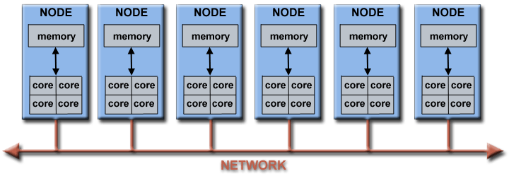
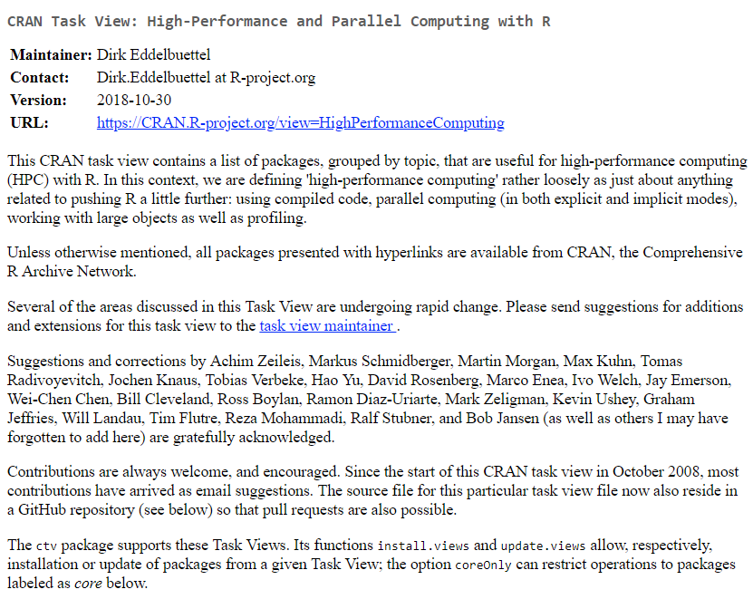
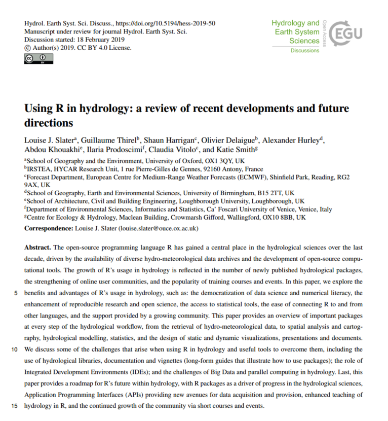

```{r setup, include=FALSE}
options(htmltools.dir.version = FALSE)

# color used in xaringanthemer
egu_blue <- rgb(red = 0, green = 112, blue = 192,maxColorValue = 255)
egu_yellow <- rgb(red = 255, green = 221, blue = 0,maxColorValue = 255)

# color used for font awesome icons
fa_color <- "lightgrey"

# SET XARINGTHEMER CHUNK TO EVAL = TRUE TO CHANGE THEME!
# xaringanthemer saves the resulting css theme in the main document directory.
# drop the 'statics/css/'  from the file path to use the new css file

# install missing packages
list.of.packages <- c("xaringan", "xaringanthemer",  "fontawesome")
new.packages <- list.of.packages[!(list.of.packages %in% installed.packages()[,"Package"])]
if(length(new.packages)) install.packages(new.packages)
# devtools::install_github("rstudio/fontawesome")
```

```{r xaringan-themer, include = FALSE, eval = FALSE}
library(xaringanthemer)

# duo_accent(primary_color = rgb(red = 0, green = 112, blue = 192,maxColorValue = 255), 
# secondary_color = rgb(red = 255, green = 221, blue = 0,maxColorValue = 255))

duo_accent(primary_color =  darken_color(egu_blue, strength = 0.3),
           secondary_color = egu_yellow,
           inverse_background_color = egu_yellow,
           inverse_text_color =  egu_blue,
           title_slide_text_color = egu_yellow,
           link_color = "darkorange",
           black_color = "gray20",
           table_row_even_background_color = lighten_color(color_hex = egu_blue, 
                                                           strength = 0.8),
           
           extra_css = list(
               ".title-logo-box" = list(
                   "height" = "1750px",
                   "width" = "175px",
                   "position" = "absolute",
                   "top" = "55%",
                   "left" = "70%"
               )),
           outfile = "rhydro.css" 
           
)
```

class: title-slide, left, middle

<h1> Introduction to parallel and high performance computing for hydrologists 
`r fontawesome::fa("github", fill = fa_color)` </h1>
<br>

<h3>Louise Slater<br> <em>University of Oxford</em> </h3>
<br>
.small[`r fontawesome::fa("home", fill = fa_color)` [louisejslater.com](https://louisejslater.com)  
`r fontawesome::fa("twitter", fill = fa_color)` [DrLouiseSlater](https://twitter.com/DrLouiseSlater)]

.title-logo-box[]


---
class: inverse

# Outline:

### Key concepts 
1. Terminology
2. Why use parallel computing? (and when?)
3. Defining parallelism

--

### Key approaches
1. For loops
2. From for loops to lapply
3. Parallelising the code (parallel / future.apply / foreach)

--

### References and resources
1. The CRAN Task View
2. Cloud computing
3. References 

---
class: inverse

# Outline:

### **Key concepts** 
1. **Terminology**
2. **Why use parallel computing? (and when?)**
3. **Defining parallelism**

### Key approaches
1. For loops
2. From for loops to lapply
3. Parallelising the code (parallel / future.apply / foreach)

### References and resources
1. The CRAN Task View
2. Cloud computing
3. References 

---

# Terminology

What are we talking about? 

### High performance computing:

* Using [supercomputers](https://en.wikipedia.org/wiki/Supercomputer) or [parallel computing](https://en.wikipedia.org/wiki/Parallel_computing) techniques to solve computational problems. 

--

### Parallel processing/computing:

* An algorithm is written to divide a large problem into smaller chunks (calculations or processes) that can be solved at the same time 

We will adopt a loose definition of HPC and PC as ["anything related to pushing R a little further"](https://cran.r-project.org/web/views/HighPerformanceComputing.html)


---
# Terminology 

- A [core](https://stackoverflow.com/questions/19225859/difference-between-core-and-processor) (processor): basic unit of the Central Processing Unit (CPU): single running version of a program. 

- A [node](https://en.wikipedia.org/wiki/Node_(computer_science): a physical device (e.g. computer) within a network. Can have multiple cores.

- A [cluster](https://en.wikipedia.org/wiki/Computer_cluster) or supercomputer: hosts multiple nodes 


```{r node, out.width = "100%", fig.align = "center", echo=FALSE, message=FALSE}

```
Parallel computing aims to increase performance typically by taking advantage of multiple cores, sometimes across multiple nodes. 

---

# Why would we use parallel computing?

.pull-left[  
Growing data in hydrology:
- Greater number and size of datasets 
- Enhanced resolution and abilities of models 

_More/better data takes longer to run. So either we spend longer running our codes, or we find ways to speed up their performance_

Parallel computing is a practical way to **speed things up**.

]

.pull-left[  

```{r gifafrica, out.width = "90%", fig.align = "center", echo=FALSE, message=FALSE}
knitr::include_graphics("./static/img/af2001.gif")
```

]

---

# When should we use parallel computing? 

.pull-left[  

It's important to note that:

* It's not always necessary or desirable to parallelise

* Efficiency does not increase linearly with the number of cores used

That said, in hydrology, parallel computing can save a lot of time. 

You **don't need a cluster or HPC** to run parallel code: most laptops have multiple cores...

The examples described here can be implemented **_either_** on your PC **_or_** on a HPC.

]

.pull-left[  

```{r gifafrica2, out.width = "90%", fig.align = "center", echo=FALSE, message=FALSE}
knitr::include_graphics("./static/img/af2001.gif")
```

]


---

# Defining parallelism

.pull-left[  

In serial code:

- chunk 1 runs. chunk 2 starts only once chunk 1 is complete

```{r track1, out.width = "100%", fig.align = "center", echo=FALSE, message=FALSE}

```
]

--

.pull-right[ 

In parallel code:

- chunk 1 and chunk 2 run simultaneously 

```{r track2, out.width = "100%", fig.align = "center", echo=FALSE, message=FALSE}

```

]

---

# Defining parallelism

* [*Implicit* parallelism](https://en.wikipedia.org/wiki/Implicit_parallelism): when the system (libraries, compiler, etc) is doing the parallelising for you. E.g. a compiler or interpreter automatically exploits the parallelism. 

--

* [*Explicit* parallelism](https://en.wikipedia.org/wiki/Explicit_parallelism): when you are the one explicitly decomposing your work into tasks. This talk focuses on explicit parallelism (e.g. packages snow, foreach, doFuture), which is more commonly used.

--

Code can be described as ["embarrassingly parallel"](https://en.wikipedia.org/wiki/Embarrassingly_parallel) when there is clear iteration independence, i.e. it is easy to separate the problem into parallel tasks, and there is little to no dependency between those tasks. 

--

Embarrassingly parallel code is quite frequent in large-sample hydrology. Example: computing catchment-averaged precipitation for 100 river basins.
```{r catchpre, out.width = "50%", fig.align = "center", echo=FALSE, message=FALSE}
knitr::include_graphics("./static/img/catchprecip.png")
```

---
class: inverse

# Outline:

### Key concepts 
1. Terminology
2. Why use parallel computing? (and when?)
3. Defining parallelism

### **Key approaches**
1. **For loops**
2. **From for loops to lapply**
3. **Parallelising the code (parallel / future.apply / foreach)**

### References and resources
1. The CRAN Task View
2. Cloud computing
3. References 

---

# 1. For loops

The for-loop is our basic example of **serial code**. 

Let's say we start with a list of three catchments.

--

Install the **rnrfa** library (Vitolo et al., 2018)
```{r rnrfainstall, execute = T, echo=TRUE, message=FALSE, eval=TRUE}
if (!require('rnrfa')) install.packages('rnrfa')
library('rnrfa')
```

--

Import the catchment catalogue and select **three gauging stations**
```{r choosecatchments, cache=TRUE, execute = T, echo=TRUE, message=FALSE, eval=TRUE}
Stations_catalogue <- catalogue() 
list_of_catchments <- c("21003","22006","27028")
```

---

# 1. For loops

In each loop we are going to download gauged daily flow for one catchment. 

First, download and plot gauged daily flow for one catchment, just to check everything is working:
```{r flowtest, execute = F, echo=TRUE, message=FALSE, eval=F}
flow <- gdf(id = "27028")
plot(flow)
```

```{r flow1, out.width = "100%", fig.align = "center", echo=FALSE, message=FALSE}
knitr::include_graphics("./static/img/flow.png")
```

---

# 1. For loops

The for-loop is our basic example of serial (sequential) code. 

Here is a simple example of a for loop where we download the *gauged daily flow* (gdf function) and compute the mean value for each catchment. 

```{r forlooptest, cache=TRUE, execute = T, echo=TRUE, message=FALSE, eval=TRUE}
my_list <- list()
for (i in list_of_catchments) { 
  flow <- gdf(id = i)
  mean_flow <- mean(flow)
  my_list[[i]] <- mean_flow
}
```

--

The result of each iteration is a single value (variable mean_flow):
```{r forlooptest2, cache=TRUE, execute = T, echo=TRUE, message=FALSE, eval=TRUE}
str(my_list) 
```

---

# 1. For loops

We can wrap the “iteration” code inside **local()** to make sure it is evaluated in a local environment. 

This simple adjustment prevents the loop from assigning values to the global environment and can prevent errors. 

```{r forloopex, cache=TRUE, execute = T, echo=TRUE, message=FALSE, eval=TRUE}
my_list <- list()
for (i in list_of_catchments) { 
  my_list[[i]] <- local({
    flow <- gdf(id = i)
    mean_flow <- mean(flow)
    mean_flow 
  })
}
```

The output remains the same.

---

# 2. From for loops to Lapply

Instead of executing each task in a sequence (where just one of the processors is used), we can use multiple processors on our computer to speed things up. 

But first, we need to write our code as a function. We do this by turning our for loop into a lapply call. The **lapply** function in base-R is a substitute to the loop, and is often faster; it works by applying a **function** over a **list** or vector (list-apply). 

--

```{r lapply1, cache=TRUE, execute = T, echo=TRUE, message=FALSE, eval=TRUE}
my_function <- function(x) {
  flow <- gdf(id = x)
  mean_flow <- mean(flow)
  mean_flow
}
my_list <- lapply(list_of_catchments, my_function)
```

--

Typically we would combine the two, like this:
```{r lapply2, cache=TRUE, execute = F, echo=TRUE, message=FALSE, eval=TRUE}
my_list <- lapply(list_of_catchments, function(x) {
    flow <- gdf(id = x)
    mean_flow <- mean(flow)
    mean_flow
  })
```

---

# 3. Parallelising the code 
    
There are many different methods to do this.

Three of the most common are:
1. The [parallel](https://stat.ethz.ch/R-manual/R-devel/library/parallel/doc/parallel.pdf) package (in base-R), which uses lapply functions and builds on the work done for CRAN packages **multicore** (Urbanek, 2009–2014) and **snow** (Tierney et al., 2003–present)

--

2. The [future.apply](https://cran.r-project.org/web/packages/future.apply/future.apply.pdf) package (Bengtsson, 2019), which makes things easier via the **future_lapply** function

--

3. The [doParallel](https://cran.r-project.org/web/packages/doParallel/doParallel.pdf) package, which uses [foreach](https://cran.r-project.org/web/packages/foreach/foreach.pdf) (Calaway et al., 2018) and the [doFuture](https://cran.r-project.org/web/packages/doFuture/doFuture.pdf) package (Bengtsson, 2019)


---

# 3.1. The parallel package

The parallel package is part of base R. It builds on earlier CRAN parallel computation packages:
* **multicore** (shared memory platforms - unix; now retired from CRAN)
* [snow](https://cran.r-project.org/web/packages/snow/index.html) (distributed memory platforms)

and allows us to run large chunks of computations in parallel.

It works with both **_shared memory_** (when multiple processing elements share the same location in memory) and **_distributed memory_** (which requires explicit commands to transfer data from one processing element to another)

Check the online [vignette](https://stat.ethz.ch/R-manual/R-devel/library/parallel/doc/parallel.pdf) for the parallel package, by simply typing in the R console:
```{r parallel1, execute = FALSE, echo=TRUE, message=FALSE, eval=FALSE}
vignette("parallel")
```

---

# 3.1. The parallel package 

Load the library
```{r parallel2, execute = T, echo=TRUE, message=FALSE, eval=FALSE}
library(parallel)
```

--

Check the number of CPU cores on your computer
```{r cores, execute = T, echo=TRUE, message=FALSE, eval=FALSE}
ncores <- detectCores()
ncores
```

--
 
Start the cluster 
```{r cores3, execute = F, echo=TRUE, message=FALSE, eval=FALSE}
my_cluster <- makeCluster(ncores)
```

---

# 3.1. The parallel package 

When parallelising you have to explicitly export/declare everything you need to perform the parallel operation to each thread

--

**clusterEvalQ** loads an expression on each cluster node:
```{r parall1, execute = F, echo=TRUE, message=FALSE, eval=FALSE}
clusterEvalQ(my_cluster, {library(rnrfa)}) 
```

--

**ClusterExport** exports objects from the base workspace to the global environments of each node (in this case we don't really need it because we won't be using the Station catalogue, so this is just an example)
```{r parall2, execute = F, echo=TRUE, message=FALSE, eval=FALSE}
clusterExport(my_cluster, list( 'Stations_catalogue'))
```

--

Now we can run the **parallel version of lapply** from the **snow** package:
```{r parall3, execute = F, echo=TRUE, message=FALSE, eval=FALSE}
parLapply(my_cluster, list_of_catchments,
          function(x) {
            flow <- gdf(id = x)
            mean_flow <- mean(flow)
            mean_flow
          })
```

---

# 3.1. The parallel package 

## Close the cluster

After running your parallel code it is useful to stop the cluster.

For a manually created cluster, it is best to stop it as follows:

```{r stop, execute = F, echo=TRUE, message=FALSE, eval=FALSE}
stopCluster(my_cluster)
```

---

# 3.2. Using the future.apply package

The **future.apply** package allows us to easily parallelise lapply.
```{r para1, execute = F, echo=TRUE, message=FALSE, eval=FALSE}
if (!require('future.apply')) install.packages('future.apply')
library('future.apply')
```

The function **plan(multiprocess)** parallelises the code on your local computer for you. 

It queries the machine (using availableCores()) to infer how many cores can be used simultaneously, so there is no need to explicitly specify how many cores are available:
```{r para2, execute = F, echo=TRUE, message=FALSE, eval=FALSE}
plan(multiprocess) 
#plan(sequential) # returns to sequential processing
```

---

# 3.2. Using the future.apply package

Now all we have to do is to replace lapply() with **future_lapply()**:
```{r para3, execute = F, echo=TRUE, message=FALSE, eval=FALSE}
my_list <- future_lapply(list_of_catchments, function(x) {
  flow <- gdf(id = x)
  mean_flow <- mean(flow)
  mean_flow
})
```

---

# 3.3. With the foreach framework

The [doParallel foreach](https://cran.r-project.org/web/packages/doParallel/vignettes/gettingstartedParallel.pdf) framework is another way of parallelising code. It is somewhat similar to the lapply approach. You have to explicitly create the cluster:
```{r para4, execute = F, echo=TRUE, message=FALSE, eval=FALSE}
library(doParallel)
detectCores() # As before, check cores
my_cluster <- makeCluster(ncores) # Create cluster
registerDoParallel(my_cluster) # Register cluster
getDoParWorkers() # Check how many cores are being used
```

--

Implement foreach as: 
```{r para5, execute = F, echo=TRUE, message=FALSE, eval=FALSE}
result <- foreach(x=list_of_catchments) %dopar% {
  library(rnrfa)
  flow <- gdf(id = x)
  mean_flow <- mean(flow)
  mean_flow
}
stopCluster(my_cluster)
```

---

# 3.3. With the foreach framework

The **_simplified_** version of foreach can be implemented with the **doFuture** package: 
```{r dofut, execute = F, echo=TRUE, message=FALSE, eval=FALSE}
if (!require('doFuture')) install.packages('doFuture')
library('doFuture')
```

--

doFuture provides access to the **future framework** and the full range of parallel backends that comes with it
```{r dofut1, execute = F, echo=TRUE, message=FALSE, eval=FALSE}
registerDoFuture()
plan(multiprocess)

my_list <- foreach(x = list_of_catchments) %dopar% {
  flow <- gdf(id = x)
  mean_flow <- mean(flow)
  mean_flow
}
```

---

# Summary of these approaches

According to the author of the future package (see [here](https://www.jottr.org/2019/01/11/parallelize-a-for-loop-by-rewriting-it-as-an-lapply-call/)), one of the simplest approaches to parallel computing is to parallelize your for-loop with the future package:

1.	Rewrite your for-loop such that each iteration is done *inside a local() call*

2.	Rewrite this new for-loop as a *lapply call* (straightforward)

3.	Replace the lapply call with a *parallel implementation* of your choice 


---
class: inverse

# Outline:

### Key concepts 
1. Terminology
2. Why use parallel computing? (and when?)
3. Defining parallelism

### Key approaches
1. For loops
2. From for loops to lapply
3. Parallelising the code (parallel / future.apply / foreach)

### **References and resources**
1. **The CRAN Task View**
2. **Cloud computing**
3. **References** 

---

# The CRAN Task View for HPC

The Task View can be accessed online at  [https://cran.r-project.org/web/views/HighPerformanceComputing.html](https://cran.r-project.org/web/views/HighPerformanceComputing.html):

```{r TaskView, out.width = "70%", fig.align = "center", echo=FALSE, message=FALSE}
#{r echo=FALSE, results='hide',message=FALSE}

```

---

# The CRAN Task View for HPC

- Explicit parallel computing 

- Implicit parallel computing 

- Grid computing

- Hadoop, Random numbers, Resource managers and batch schedulers

- Applications, GPUs

- Large memory and out-of-memory data

- Easier interfaces for Compiled code

- Profiling tools


---

# Cloud computing

```{r cloud, out.width = "90%", fig.align = "center", echo=FALSE, message=FALSE}
#{r echo=FALSE, results='hide',message=FALSE}
knitr::include_graphics("./static/img/RStudiocloud.png")
```

It's worth mentioning that cloud computing is another way to increase code efficiency **for those who do not have access** to a powerful computer to run parallel code.

--

There is no software to install or configure. You can run R directly in the browser, and you can execute your parallel code in the cloud.

---

# Come to see our PICO: 'Using R in hydrology'

.pull-left[  
Friday 12th, PICO spot 5b (8:30-10:15) 

In this fantastic session [HS1.2.7](https://meetingorganizer.copernicus.org/EGU2019/picos/31717): 
## Innovative methods to facilitate open science and data analysis in hydrology.


]

.pull-right[  
```{r rhydro, out.width = "100%", fig.align = "center", echo=FALSE, message=FALSE}

```
]

---

# References

Helpful tutorials and references to go further:

- M.Jones (2017), [Quick Intro to Parallel Computing in R](https://nceas.github.io/oss-lessons/parallel-computing-in-r/parallel-computing-in-r.html) 

- H.Bengtsson (2019), author of the future package, [Parallelize a For-Loop by Rewriting it as an Lapply Call](https://www.jottr.org/2019/01/11/parallelize-a-for-loop-by-rewriting-it-as-an-lapply-call/)

- F.Schwendinger et al. (2017), [High Performance Computing with Applications in R](http://statmath.wu.ac.at/~schwendinger/HPC/HPC.pdf)

- G.Lockwood (2015), [Using R on HPC Clusters](http://www.glennklockwood.com/data-intensive/r/on-hpc.html) or [Parallel Options for R](http://www.glennklockwood.com/data-intensive/r/parallel-options.html)

- A.Mirshani (2019), [Parallel computing cheat sheet](https://github.com/rstudio/cheatsheets/raw/master/parallel_computation.pdf) (note: the link downloads the PDF)

