```{r setup, include=FALSE}
options(htmltools.dir.version = FALSE)
knitr::opts_chunk$set(fig.retina = 3, warning = FALSE, message = FALSE)


```


```{r presi-setup, include=FALSE}


# color used in xaringanthemer
egu_blue <- rgb(red = 0, green = 112, blue = 192,maxColorValue = 255)
egu_yellow <- rgb(red = 255, green = 221, blue = 0,maxColorValue = 255)

# color used for font awesome icons
fa_color <- "lightgrey"


```


class: title-slide, left, middle

<h1> Staying up-to date:<br> 
 automating tasks from downloading data to reporting </h1>

<br>


<h3> Alex Hurley <br> 
<em>University of Birmingham</em> 
</h3>
<br>
<br>
.small[`r fontawesome::fa("home", fill = fa_color)` [aglhurley.rbind.io](https://aglhurley.rbind.io)  
`r fontawesome::fa("twitter", fill = fa_color)` [aglhurley](https://twitter.com/aglhurley)]


.title-logo-box[]


---

# Goals

--


.middle[

- `r fontawesome::fa("bolt", fill = egu_yellow)` Discuss why and what to automate

- `r fontawesome::fa("recycle", fill = egu_yellow)` Introduce task automation concepts  

- `r fontawesome::fa("screwdriver", fill = egu_yellow)` Highlight tools for each

- `r fontawesome::fa("lightbulb", fill = egu_yellow)` Use-case: Study Site Explorer with `R` and `TravisCI`
]

--

### Study Site Explorer?

--

.center[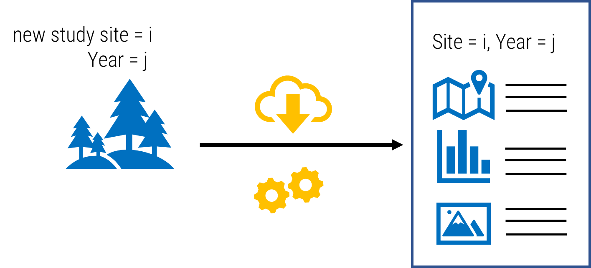]


---

# What and why?

--

- `r fontawesome::fa("retweet", fill = egu_yellow)` recurring tasks: database updates, time series, ancillary data

- `r fontawesome::fa("hourglass-end", fill = egu_yellow)` time-consuming tasks: QA + QC, updating/creating reports

- `r fontawesome::fa("screwdriver", fill = egu_yellow)` automated testing (package development)


<br>
<br>

.center[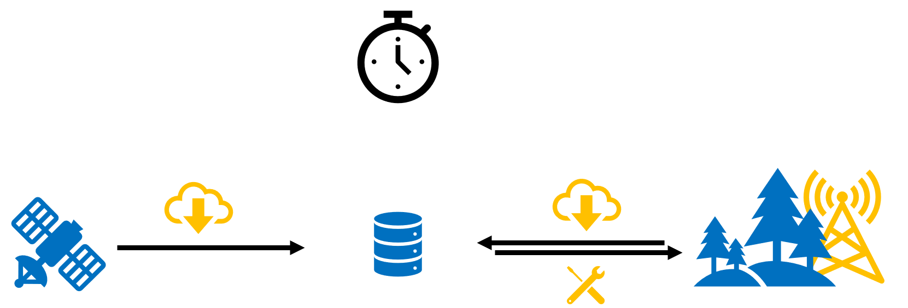]

.center[
Download on schedule  
Field station broken? Bring tools on next trip]


---

# Concepts

--

### Storage

.left-column[
<br>
<br>
**local** `r fontawesome::fa("desktop", fill = egu_yellow)`:
<br>
<br>
<br>
<br>
*vs.*
<br>
<br>
<br>
<br>
**hosted** `r fontawesome::fa("cloud", fill = egu_yellow)`:
]
--
.right-column[
- software / triggers, 
- routines (e.g. `R` scripts), 
- outputs  
are **on your computer**
<br>
<br>
<br>
<br>
<br>


- routines and outputs in a repository
- software on a virtual machine
- webservice schedules / triggers  (webhooks)    
**download** or view online]


---
# Concepts

--

### Execution / Trigger


.center[ `r fontawesome::fa("retweet", fill = egu_yellow)` recurring + `r fontawesome::fa("clock", fill = egu_yellow)` scheduled
<br> 
<br> 
<br> 
*vs.*  
<br>
<br>
`r fontawesome::fa("bolt", fill = egu_yellow)` event-based (e.g. on file change)]

---
class: inverse, center, middle

# Tools

---

layout: true

# Tools

---

### Scheduling (local)

--

`r fontawesome::fa("box", fill = egu_yellow)` [`taskscheduleR`](https://github.com/cran/taskscheduleR)

.center[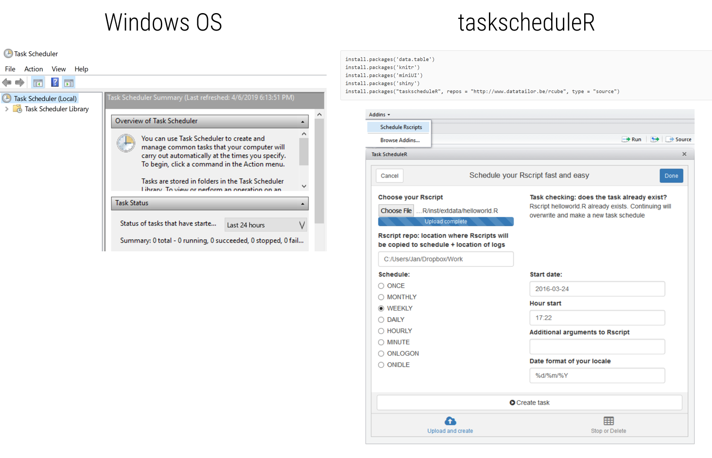]


---

### Scheduling (local)

--

`r fontawesome::fa("linux", fill = egu_yellow)` Linux via shell scripts:  

- `r fontawesome::fa("clock", fill = egu_yellow)` **cron** for recurring tasks 
- `r fontawesome::fa("calendar", fill = egu_yellow)` **at** for one-of tasks 


---

### Event-based 

`rOpenSci` `r fontawesome::fa("box", fill = egu_yellow)`  [`drake`](https://github.com/ropensci/drake):

- semi-automated workflow manager
- monitors individual units/sections of analyses pipeline
- updates on change,
- but only parts of pipeline that require re-running


.center[]

---
layout: false
class: inverse, center, middle

# Study Site Explorer

---

# Study Site Explorer


.center[]


- R Markdown report with:  
  + map  
  + annual Precipitation + Temperature  
  + 3D view of region
- Hosted online (collaborators can generate report)
- Triggered on file change (add new site)  
<br>

---

layout: true
# Study Site Explorer


---

**Use parameterized report to define meta data!**

.left-column[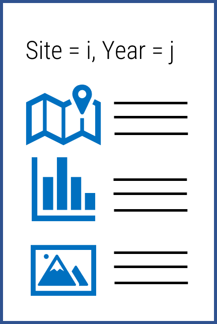]

--

.right-column[
```{r eval=FALSE, echo=TRUE}
---
author: "rHydro Demonstrator"
date: '`r paste("generated at:", Sys.Date())`'
output: html_document
params: #<<
  location: "Mt St Helens"
  year:
    value: 2000
title: "`r paste('Overview for:', params$location)`" #<<
---

```
]


---

**Define area of interest and make map:**
```{r map-fig, eval = FALSE}

# specify area of interest
aoi <- AOI::getAOI(clip = list(params$location,15 ,15), km = TRUE) #<<
    

# pull and plot map
map <- OpenStreetMap::openmap(upperLeft = c(aoi@bbox[[4]], aoi@bbox[[1]]),
                       lowerRight = c(aoi@bbox[[2]], aoi@bbox[[3]]),
                       type = "osm",
                       minNumTiles = 12)

```


---

**Download climate data and plot:**
```{r clim-fig, eval = FALSE}

```{r precip-fig, eval = FALSE}


daymet_data <- daymetr::download_daymet(lat = aoi@polygons[[1]]@labpt[2],
                                   lon = aoi@polygons[[1]]@labpt[1],
                                   start = params$year,#<<
                                   end = params$year) #<<


daymet_data$data <- dplyr::mutate(daymet_data$data,
                             tmean = (tmax..deg.c. + tmin..deg.c.)/2,
                             date = as.Date(paste(year, yday, sep = "-"),
                                            "%Y-%j"))

library(ggplot2)
ggplot(daymet_data$data,
       aes(x = date,
     y = prcp..mm.day.))  +
    
    geom_col(position = "dodge",
             color = "darkblue") +
    
    labs(x = "Date",
         y = "P (mm/day)",
         title = paste0(params$location,": ", #<<
                        params$year, #<<
                        " - Precipitation")) +
    theme_bw()

```


---

**3D-Viz of Site** ([full code available here](https://github.com/the-Hull/02_task_automation/))
```{r, eval = FALSE}
ned_aoi <- aoi %>% HydroData::findNED() # National DEM #<<

# convert to matrix for rayshader
ned <- matrix(raster::extract(ned_aoi$NED,
                              raster::extent(ned_aoi$NED),
                              buffer=1000),
             nrow=ncol(ned_aoi$NED),ncol=nrow(ned_aoi$NED))

overlay <- create_overlay(prcp_raster, ned_aoi$NED)


library(rayshader)
ned %>%
    sphere_shade(texture = "imhof1") %>%
    add_water(detect_water(ned), color="desert") %>%
      add_overlay(overlay, alphacolor = NULL, alphalayer = 0.8) %>%
    add_shadow(ray_shade(ned)) %>%
    add_shadow(ambient_shade(ned)) %>%
    plot_3d(heightmap = ned ,
            zscale = 1,
            # fov = 90,
            lineantialias = TRUE,
            theta = 15,
            phi = 85,
            zoom = 0.3)
render_snapshot()
rgl::rgl.close()

```


---
layout: true

# Study Site Explorer

---

**Generate report**

```{r generate-report, eval = FALSE}
' Render Location and Climate report
#'
#' @param location Character, location passed to AOI::getAOI()
#' @param year Character, Year in YYYY
#'
#' @return Returns nothing, but writes a file to the reports directory
#' @export
#'
#' @examples
render_report = function(location, year) { #<<
    # house keeping on names
    location_dir <- stringr::str_replace_all(location, pattern = "[.]", "-")
    location_dir <- stringr::str_replace_all(location_dir, pattern = "[ ]", "_")

    rmarkdown::render( #<<
        "./templates/report_template.Rmd", <#<<
        params = list( #<<
            location = location, 
            year = year 
        ),
       output_dir = "./reports", 
        output_file = paste0("Report-", location_dir, "-", year, ".html")
    )
}

```

---


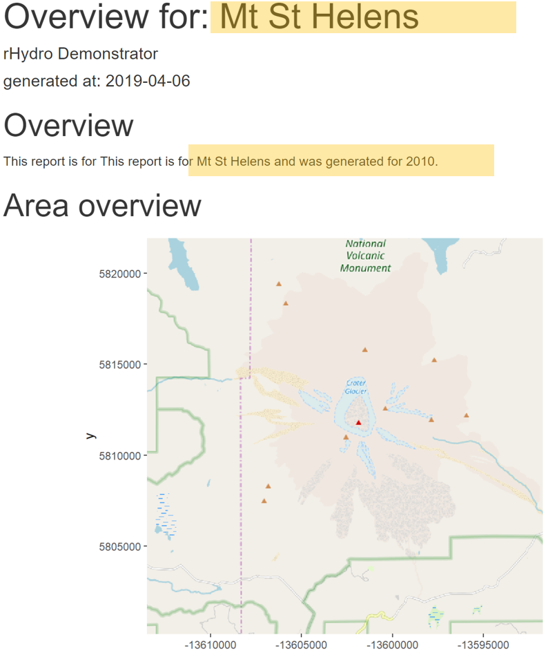

---

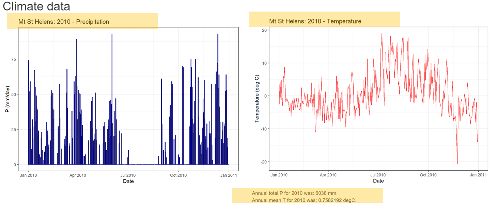

---

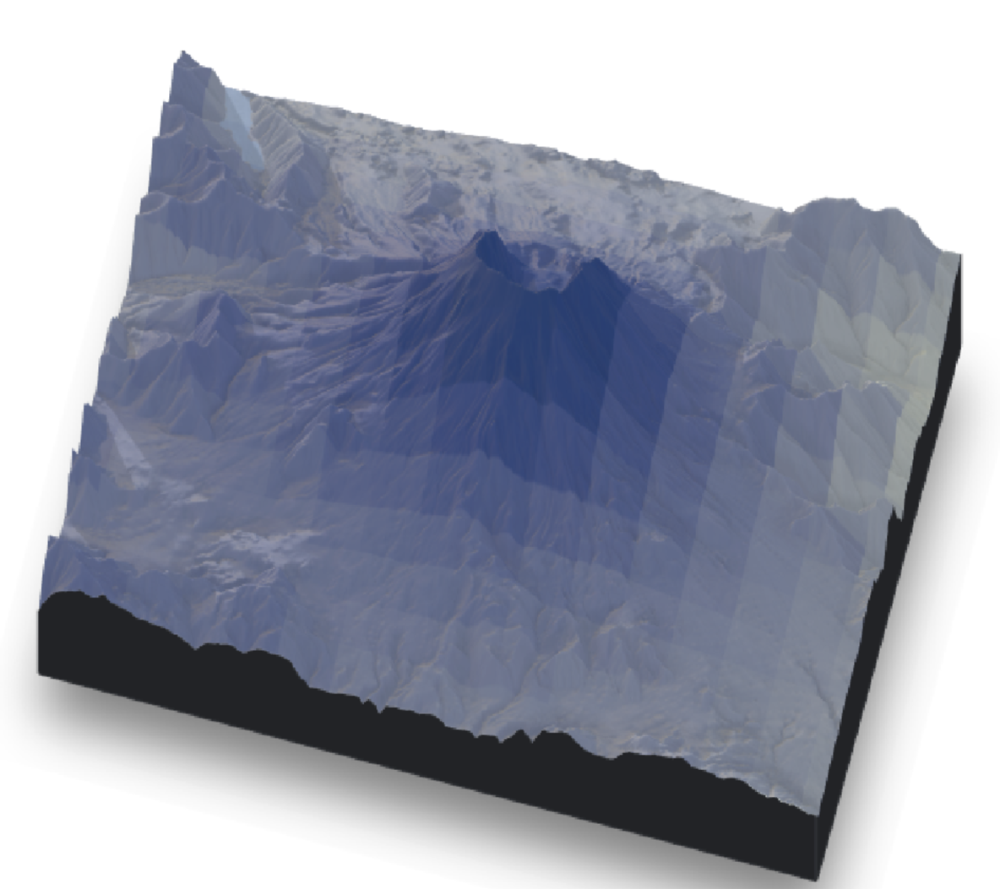

---

### Generate report for several sites:

```{r eval = FALSE}

## Script executes report generation for all locations listed in sites.txt
source("R/render_report.R")

sites <- read.csv("sites.csv", header = TRUE, stringsAsFactors = FALSE)
for(site in sites$sites){

    render_report(site, year = 2010)
}


```

---

### Generate report for several sites:


.pull-left[

```
+-- reports
|   +-- Report-Mt_Baldy-2010.html
|   +-- Report-Mt_St_Helens-2010.html
|   +-- Report-Grand_Teton_Mountain-2010.html
|   \-- Report-El_Capitan_Yosemite-2010.html
```
]

--

.pull-right[
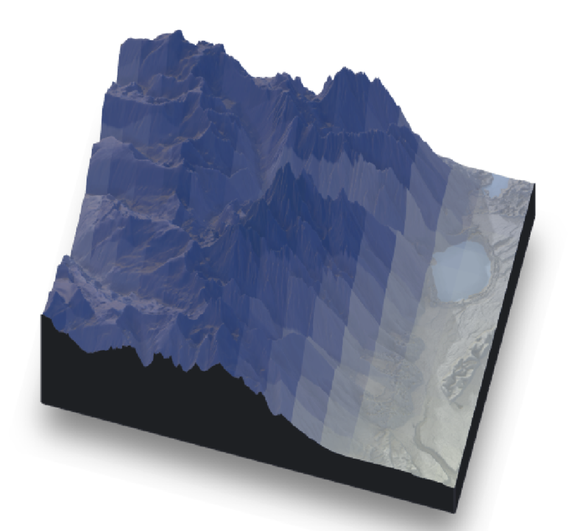
]

---

### Continuous integration with `Travis`

--

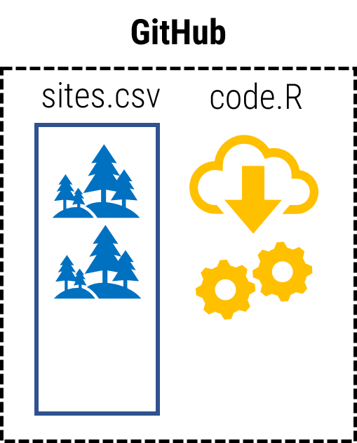

---

### Continuous integration with `Travis`


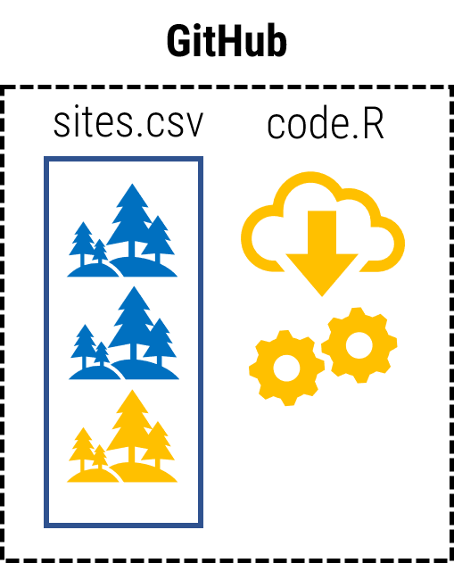

---

### Continuous integration with `Travis`


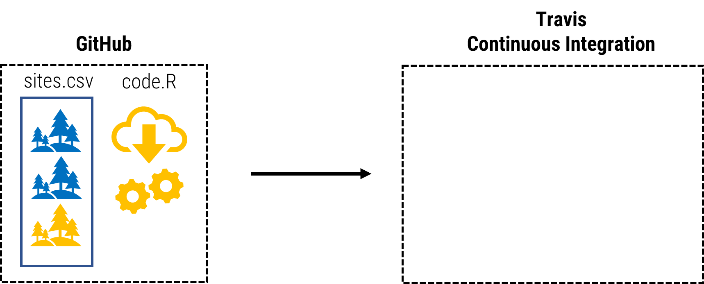


---

### Continuous integration with `Travis`


---

### Continuous integration with `Travis`


---

### Continuous integration with `Travis`


<!-- --- -->

<!-- ### Continuous integration -->


<!-- 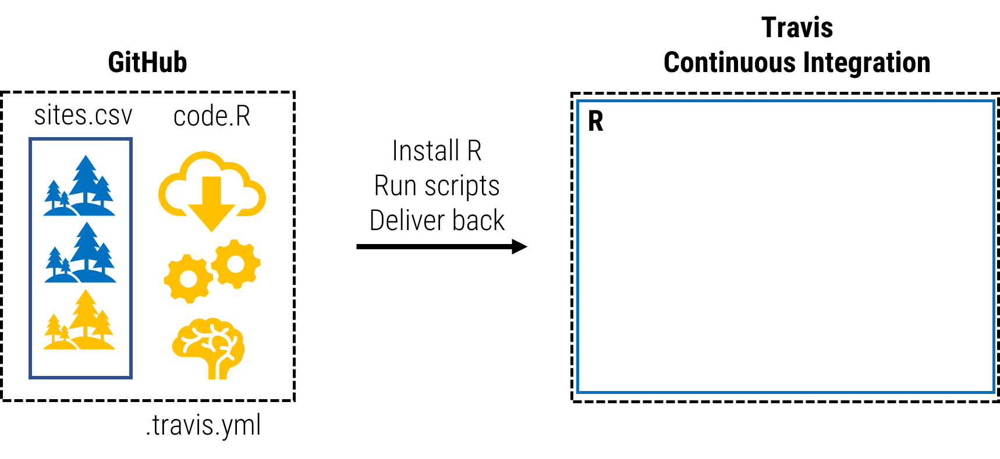 -->

---

### Continuous integration with `Travis`


---

### Continuous integration with `Travis`


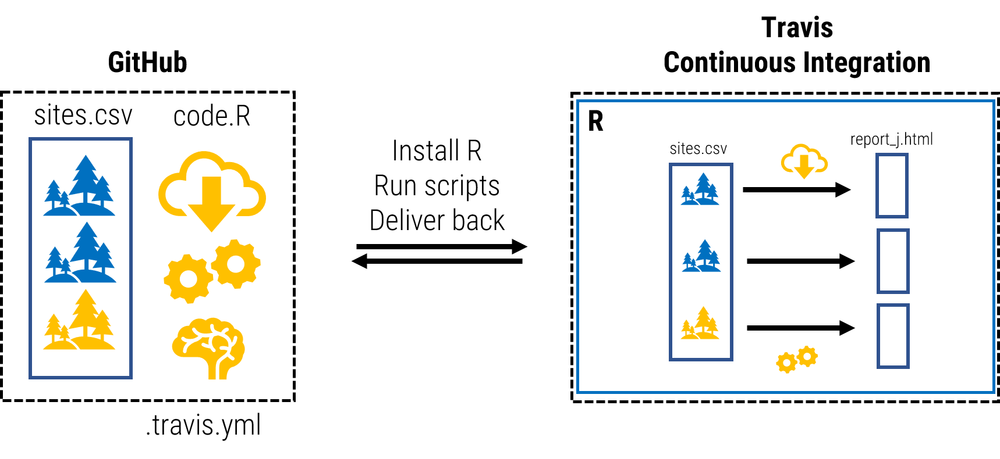


---


### Continuous integration with `Travis`


.pull-left[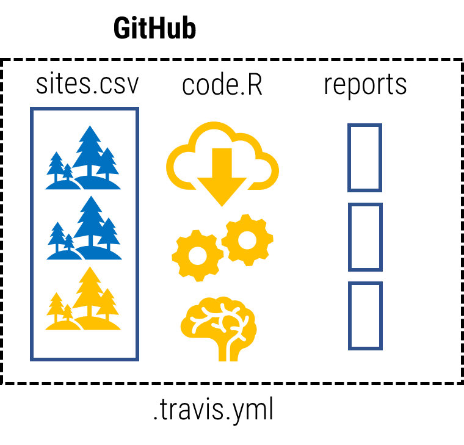]

--


.pull-right[
```{r eval=FALSE}
sudo: required
language: r #<<
cran: https://cran.rstudio.com/
cache: packages
before_install:
after_success:
install:
    - Rscript install_packages.R #<<
script: 
    - Rscript generate_parameter_reports.R #<<
    - Rscript push_back.R #<<
env:
    global:
    secure: <GitHub_Access_Token> #<<
```

]


---
layout: false

# Summary:

--

### Notes:

- Requires GitHub account
- Linked to `TravisCI` (`CircleCI` as alternative)
- Build a config `.travis.yml`
- See in action: [github.com/the-hull/02_task_automation](https://github.com/the-hull/02_task_automation)

--

### Task Automation

- Useful locally or hosted
- Frees up time
- Builds up and checks data sets
- When hosted, allows collaborators to produce standardized outputs


