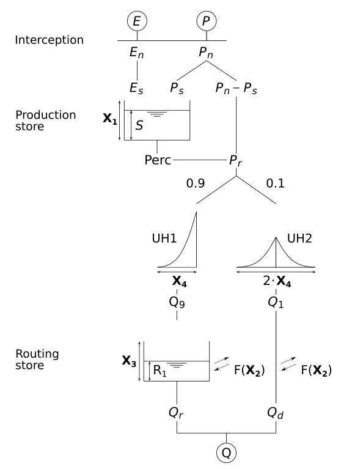
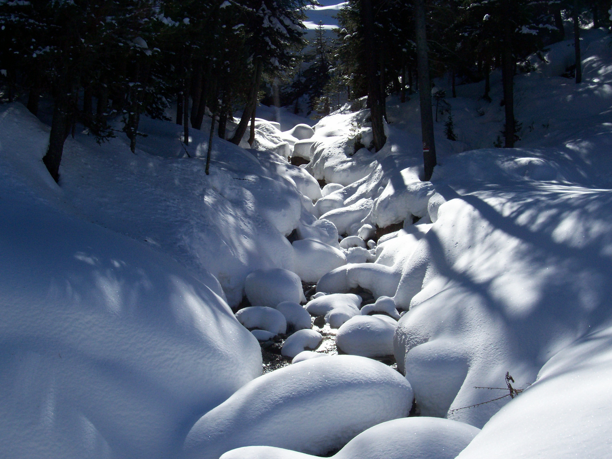
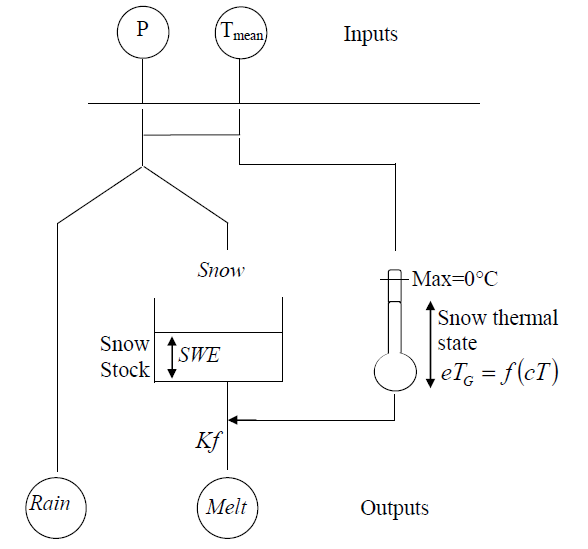
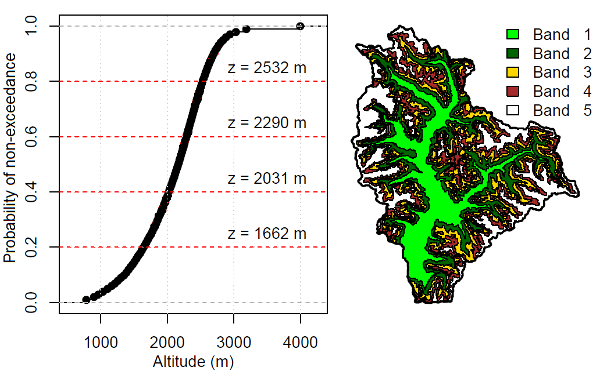
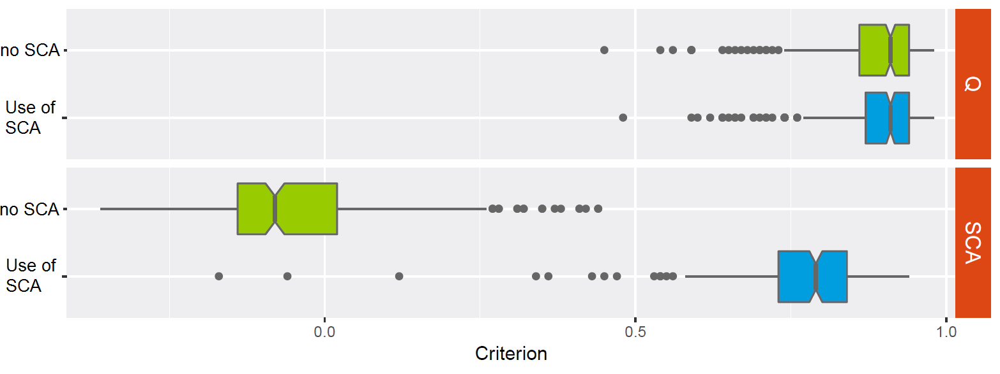

```{r setup, include=FALSE}
options(htmltools.dir.version = FALSE)
# color used in xaringanthemer
egu_blue <- rgb(red = 0, green = 112, blue = 192,maxColorValue = 255)
egu_yellow <- rgb(red = 255, green = 221, blue = 0,maxColorValue = 255)
# color used for font awesome icons
fa_color <- "lightgrey"
# SET XARINGTHEMER CHUNK TO EVAL = TRUE TO CHANGE THEME!
# xaringanthemer saves the resulting css theme in the main document directory.
# drop the 'statics/css/'  from the file path to use the new css file
# intsall missing packages
list.of.packages <- c("xaringan", "xaringanthemer", "emo", "fontawesome")
new.packages <- list.of.packages[!(list.of.packages %in% installed.packages()[,"Package"])]
# if(length(new.packages)) install.packages(new.packages)
```

```{r xaringan-themer, include = FALSE, eval = FALSE}
library(xaringanthemer)
# duo_accent(primary_color = rgb(red = 0, green = 112, blue = 192,maxColorValue = 255), 
# secondary_color = rgb(red = 255, green = 221, blue = 0,maxColorValue = 255))
duo_accent(primary_color =  darken_color(egu_blue, strength = 0.3),
           secondary_color = egu_yellow,
           inverse_background_color = egu_yellow,
           inverse_text_color =  egu_blue,
           title_slide_text_color = egu_yellow,
           link_color = "darkorange",
           black_color = "gray20",
           table_row_even_background_color = lighten_color(color_hex = egu_blue, 
                                                           strength = 0.8),
           
           extra_css = list(
             ".title-logo-box" = list(
               "height" = "1750px",
               "width" = "175px",
               "position" = "absolute",
               "top" = "55%",
               "left" = "70%"
             )),
           outfile = "rhydro.css" 
           
)
```

class: title-slide, left, middle

<h1> Modelling the hydrological cycle in snow-dominated catchments  </h1>

<br>


<h3> Guillaume THIREL <br> <em>Irstea</em> </h3>
<br>
<br>
.small[`r fontawesome::fa("home", fill = fa_color)` [irstea.fr/en/thirel](irstea.fr/en/thirel)
`r fontawesome::fa("twitter", fill = fa_color)` [G_Thirel](https://twitter.com/G_Thirel)]

.title-logo-box[]


---


<style>
.column-left{
  float: left;
  width: 35%;
  text-align: left;
}
.column-right{
  float: right;
  width: 65%;
  text-align: right;
}
</style>

# Reminder of last year

Last year, I introduced rainfall-runoff modelling.

Updated list of hydrological modelling packages in 

- **airGR**
- **airGRteaching**
- **dynatopmodel**
- **Ecohydmod**
- **fuse**
- **hydromad** (not on CRAN)
- **sacsmaR** (not on CRAN)
- **topmodel**
- **TUWmodel**
- **WALRUS** (not on CRAN)
- etc.

---

# Example of a rainfall-runoff model

<div class="column-left" style="width:300px">
Strictly speaking, rainfall-runoff 
models transform rainfall inputs 
into discharge (runoff). 
<br>
<br>
<br>
<br>
<br>
<br>
&nbsp; &nbsp;&nbsp; &nbsp;&nbsp; &nbsp;&nbsp; &nbsp;&nbsp; &nbsp;&nbsp; &nbsp;&nbsp; &nbsp;&nbsp; &nbsp;&nbsp; &nbsp;&nbsp; &nbsp;&nbsp; &nbsp;&nbsp; &nbsp;&nbsp; &nbsp;&nbsp; &nbsp;&nbsp; &nbsp;&nbsp; &nbsp;&nbsp; &nbsp;&nbsp; &nbsp;&nbsp; &nbsp;&nbsp; &nbsp;&nbsp; &nbsp;&nbsp; &nbsp;&nbsp; &nbsp;&nbsp; &nbsp;&nbsp; &nbsp;&nbsp; &nbsp;&nbsp; &nbsp;&nbsp; &nbsp;&nbsp; &nbsp;&nbsp; &nbsp;&nbsp; &nbsp;&nbsp; &nbsp;GR4J ->
</div>

<div class="column-right" style="width:400px">

</div>

---

# Example of a rainfall-runoff model

Example of running GR4J from **airGRteaching** on an Australian basin:
<center>
```{r , include = TRUE, eval = TRUE, echo = FALSE, message = FALSE, warning = FALSE, fig.width=11, fig.height=4}
rm(list = ls())
library(airGRteaching)
library(airGR)

## data.frame of observed data
data(L0123001)
BasinObs2 <- BasinObs[, c("DatesR", "P", "E", "Qmm", "T")]

## Preparation of observed data for modelling
PREP <- PrepGR(ObsDF = BasinObs2, HydroModel = "GR4J", CemaNeige = FALSE)
## Simulation step using model parameters set by the user
SIM <- SimGR(PrepGR = PREP, Param = c(270.426, 0.984, 108.853, 2.149), EffCrit = "KGE2",
             WupPer = NULL, SimPer = c("1994-01-01", "1998-12-31"))
dyplot(SIM)                        
```
</center>

---

# Let it snow...

<div class="column-left"">
Snowfall happens when temperatures are close to 0&nbsp;°C or lower. 
<br>
<br>
Snow is stored in the <b>snowpack</b>, to be released days to months later when temperature rise above 0&nbsp;°C for a substancial period of time. <br>
<br>
This creates a <b>shift between precipitation</b> (rainfall + snowfall) <b>and discharge</b>. 
</div>
<div class="column-right"">

</div>

---

# Let it snow...

Example of simulating a snow-dominated basin with only a rainfall-runoff model: 
<center>

</center>

```{r , include = FALSE, eval = FALSE, echo = FALSE, message = FALSE, warning = FALSE, fig.width=9}
library(airGRteaching)
library(airGR)

## data.frame of observed data
data(X0310010)
BasinObs2 <- BasinObs[, c("DatesR", "P", "E", "Qmm", "T")]

## Preparation of observed data for modelling
PREP <- PrepGR(ObsDF = BasinObs2, HydroModel = "GR4J", CemaNeige = FALSE)
## Simulation step using model parameters set by the user
SIM <- SimGR(PrepGR = PREP, Param = c(240, 1.5, 90, 2.1), EffCrit = "KGE2",
             WupPer = NULL, SimPer = c("2004-01-01", "2004-12-31"))
plot(SIM)                        
```

---

# Let it snow...

<div class="column-left"">
Modelling the snow accumulation and melt improves a lot the simulations. 
<br>
<br>

Same simulation with a snow model activated: 

</div>

<div class="column-right">

```{r , include = TRUE, eval = FALSE, echo = FALSE, message = FALSE, warning = FALSE, fig.width=9}
library(airGRteaching)
library(airGR)

## data.frame of observed data
data(X0310010)
BasinObs2 <- BasinObs[, c("DatesR", "P", "E", "Qmm", "T")]

## Preparation of observed data for modelling
PREP <- PrepGR(ObsDF = BasinObs2, HydroModel = "GR4J", CemaNeige = TRUE)
## Simulation step using model parameters set by the user
SIM <- SimGR(PrepGR = PREP, Param = c(240, 1.5, 90, 2.1, 0.1, 2), EffCrit = "KGE2",
             WupPer = NULL, SimPer = c("2004-01-01", "2004-12-31"))
plot(SIM)                        
```
</div>

---

# Principles of snow models/modules

### Step 1: Accumulation

Snowpack = Snowpack + Snowfall

<br><br>
Depending on temperature, precipitation is either considered as rainfall or snowfall (or a mix of both).

Frequently we find the following:
- Snowfall if T < 0 °C and rainfall if T >= 0 °C

or

- Snowfall if T < -1 °C, rainfall if T > +3 °C, a linear mix of both in between
---

# Principles of snow models/modules

### Step 2: Melting

Snowpack = Snowpack - Snow melt

#### Degree-day models

- Very common for catchment hydrology
- Simplest option
- Require only P and T

Principle: the rate at which snow melts is governed by the temperature above a threshold (e.g. 0 °C) and a parameter (expressed in mm/°C/day).

#### Energy-balance models

- Quite common for catchment hydrology
- More complex
- Require several variables sometimes difficult to obtain, such as wind speed, radiation, air humidity... 

---

# Snow models in R packages

Not all hydrological modelling R packages contain a snow component. 

We could identify:

- CemaNeige in **airGR** and **airGRteaching**
- SNOW17 in **sacsmaR**
- a module in **SWATmodel**
- a module in **TUWmodel**
- a module in **WALRUS**
- etc. 


---

# The CemaNeige example in airGR

<div class="column-left"">
CemaNeige is a degree-day model.
<br>
<br>

It was conceived on the principle of having a model "as simple as possible but not simpler"... </div>
<div class="column-right"">

</div>

---

# The importance of taking into account altitude gradients




---

# How to extrapolate lumped input in airGR

```{r , include = TRUE, eval = TRUE, echo = FALSE, message = FALSE, warning = FALSE, fig.width=9}
library(airGR)

## loading catchment data
rm(BasinObs)
data(X0310010)
BasinObs2 <- BasinObs
BasinObs <- BasinObs[, c("DatesR", "P", "T", "E", "Qmm")]
```
Initially, we have lumped input:
```{r , include = TRUE, eval = TRUE, echo = TRUE, message = FALSE, warning = FALSE, fig.width=9}
head(BasinObs, n = 2)
```
Let's extrapolate data (we often do that on 5 elevation bands):
```{r , include = TRUE, eval = TRUE, echo = TRUE, message = FALSE, warning = FALSE, fig.width=9}
## preparation of the InputsModel object
BasinObs <- BasinObs2
InputsModel <- 
  CreateInputsModel(FUN_MOD = RunModel_CemaNeigeGR4J, 
                    DatesR = BasinObs$DatesR, 
                    Precip = BasinObs$P, 
                    PotEvap = BasinObs$E, 
                    TempMean = BasinObs$T, 
                    ZInputs = median(BasinInfo$HypsoData),
                    HypsoData = BasinInfo$HypsoData, 
                    NLayers = 5)
```

---

# How to extrapolate lumped input in airGR

What we get as inputs:
```{r , include = TRUE, eval = FALSE, echo = TRUE, message = FALSE, warning = FALSE, fig.width=9}
str(InputsModel)
```
```{r , include = TRUE, eval = TRUE, echo = FALSE, message = FALSE, warning = FALSE, fig.width=9}
InputsModel2 <- InputsModel
InputsModel2$LayerFracSolidPrecip <- NULL
str(InputsModel2)
```

---

# How to extrapolate lumped input in airGR

Simulations:
```{r , include = TRUE, eval = TRUE, echo = FALSE, message = FALSE, warning = FALSE, fig.width=9}
## run period selection
Ind <- seq(which(format(BasinObs$DatesR, format = "%Y-%m-%d")=="2004-01-01"), 
           which(format(BasinObs$DatesR, format = "%Y-%m-%d")=="2004-12-31"))


## ---- original version of CemaNeige

## preparation of the RunOptions object
RunOptions <- CreateRunOptions(FUN_MOD = RunModel_CemaNeigeGR4J, InputsModel = InputsModel, 
                               IndPeriod_Run = Ind)
## Parameters setting
Param <- c(X1 = 310, X2 = 3.6, X3 = 340, X4 = 1.,
           CNX1 = 0.7, CNX2 = 5)

## simulation
OutputsModel <- RunModel_CemaNeigeGR4J(InputsModel = InputsModel,
                                       RunOptions = RunOptions, 
                                       Param = Param)
```

```{r , include = TRUE, eval = TRUE, echo = TRUE, message = FALSE, warning = FALSE}
## preparation of the RunOptions object
RunOptions <- CreateRunOptions(FUN_MOD = RunModel_CemaNeigeGR4J, 
                               InputsModel = InputsModel, 
                               IndPeriod_Run = Ind)

## Parameters setting
Param <- c(X1 = 310, X2 = 3.6, X3 = 340, X4 = 1.,
           CNX1 = 0.7, CNX2 = 5)

## simulation
OutputsModel <- RunModel_CemaNeigeGR4J(InputsModel = InputsModel,
                                       RunOptions = RunOptions, 
                                       Param = Param)

```

```{r , include = TRUE, eval = FALSE, echo = TRUE, message = FALSE, warning = FALSE}
# plot of selected variables
plot(OutputsModel, Qobs = BasinObs$Qmm[Ind], 
     which = c("Precip", "Temp", "SnowPack", "Flows"))

```

---
# How to extrapolate lumped input in airGR

```{r , include = TRUE, eval = TRUE, echo = FALSE, message = FALSE, warning = FALSE, fig.width=7, fig.align = "center"}
# plot of selected variables
plot(OutputsModel, Qobs = BasinObs$Qmm[Ind], 
     which = c("Precip", "Temp", "SnowPack", "Flows"))

```

---

# A step forward: using (satellite) snow data

Most of the time, snow modules are calibrated together with rainfall-runoff models with discharge data only. 

Using snow data in addition to discharge can better constrain the model and therefore improve the simulations.


### Packages to retrieve MODIS sensor SCA data

- **MODIS**: Acquisition and Processing of MODIS Products
- **MODISSnow**: Provides a Function to Download MODIS Snow Cover

### Other snow data sources

- **snotelr**: Calculate and Visualize 'SNOTEL' Snow Data and Seasonality

---

# Calibrating CemaNeige with MODIS SCA

```{r , include = TRUE, eval = TRUE, echo = FALSE, message = FALSE, warning = FALSE, fig.width=9}
data(X0310010)
BasinObs <- BasinObs[1097:1100,]
row.names(BasinObs) <- NULL
options("digits" = 3)
```
Initially, we have lumped input:
```{r , include = TRUE, eval = TRUE, echo = TRUE, message = FALSE, warning = FALSE, fig.width=9}
head(BasinObs, n = 2)
```

```{r , include = TRUE, eval = TRUE, echo = FALSE, message = FALSE, warning = FALSE, fig.width=9}
options("digits" = 7)
## preparation of the RunOptions object
data(X0310010)
RunOptions <- CreateRunOptions(FUN_MOD = RunModel_CemaNeigeGR4J, InputsModel = InputsModel, 
                               IndPeriod_Run = Ind, IsHyst = TRUE)
## preparation of CalibOptions object
CalibOptions <- CreateCalibOptions(FUN_MOD = RunModel_CemaNeigeGR4J, FUN_CALIB = Calibration_Michel, IsHyst = TRUE)
```

Here we define the optimisation criterion: 

```{r , include = TRUE, eval = TRUE, echo = TRUE, message = FALSE, warning = FALSE, fig.width=7}
## criterion: 75 % KGE'(Q) + 5 % KGE'(SCA) on each of the 5 layers
inCrit <- 
  CreateInputsCrit(FUN_CRIT = rep("ErrorCrit_KGE2", 6),
                   InputsModel = InputsModel, 
                   RunOptions = RunOptions,
                   Obs = BasinObs[Ind, c("Qmm", "SCA1", "SCA2", 
                                        "SCA3", "SCA4", "SCA5")],
                   VarObs = list("Q", "SCA", "SCA", "SCA", 
                                      "SCA", "SCA"), 
                   Weights = list(0.75, 0.05, 0.05, 
                                  0.05, 0.05, 0.05))
```

---

# Calibrating CemaNeige with MODIS SCA

Let's see how GR4J + CemaNeige calibrates with the in-built **airGR** optimisation tool: 

```{r , include = TRUE, eval = TRUE, echo = TRUE, message = TRUE, warning = FALSE, fig.width=7}
OutputsCalib <- Calibration_Michel(InputsModel = InputsModel, 
                                   RunOptions = RunOptions, 
                                   InputsCrit = inCrit, 
                                   CalibOptions = CalibOptions, 
                                   FUN_MOD = RunModel_CemaNeigeGR4J)
```


---

# Calibrating CemaNeige with MODIS SCA

Validation over 277 basins: SCA is much better and Q is similar. 

We could show a better transferability of the model. 




---

# Final words

We saw how to model snow-dominated basins in R with **airGR**. 

Several snow modules are available in R. 

Several snow datasets can be retrieved with dedicated packages. 


<br>
<br>
<br>

Contact: airGR@irstea.fr

 &nbsp; &nbsp;&nbsp; &nbsp;&nbsp; &nbsp;
 &nbsp; &nbsp;
 


Meet Olivier Delaigue at the **airGR** poster
<br>
**A.39 from 8:30 am on Friday**


            