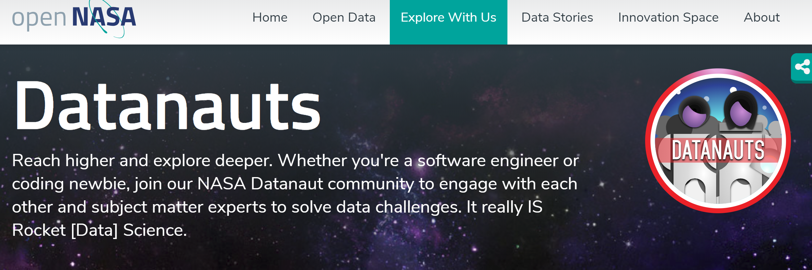

```{r setup, include=FALSE}
options(htmltools.dir.version = FALSE)

# color used in xaringanthemer
egu_blue <- rgb(red = 0, green = 112, blue = 192,maxColorValue = 255)
egu_yellow <- rgb(red = 255, green = 221, blue = 0,maxColorValue = 255)

# color used for font awesome icons
fa_color <- "lightgrey"

# SET XARINGTHEMER CHUNK TO EVAL = TRUE TO CHANGE THEME!
# xaringanthemer saves the resulting css theme in the main document directory.
# drop the 'statics/css/'  from the file path to use the new css file


# intsall missing packages
list.of.packages <- c("xaringan", "xaringanthemer", "emo", "fontawesome")
new.packages <- list.of.packages[!(list.of.packages %in% installed.packages()[,"Package"])]
if(length(new.packages)) install.packages(new.packages)

```


class: title-slide, left, middle

<h1> Community-led initiatives </h1>

<br>


<h4> Claudia Vitolo </h4>
.small[`r fontawesome::fa("home", fill = fa_color)` [aquaresearcher.wordpress.com](https://aquaresearcher.wordpress.com)  
`r fontawesome::fa("twitter", fill = fa_color)` [clavitolo](https://twitter.com/clavitolo)]

<h4> Alexander Hurley </h4>
.small[`r fontawesome::fa("home", fill = fa_color)` [aglhurley.rbind.io](https://aglhurley.rbind.io)  
`r fontawesome::fa("twitter", fill = fa_color)` [aglhurley](https://twitter.com/aglhurley)]

<h4> Ilaria Prosdocimi </h4>
.small[`r fontawesome::fa("home", fill = fa_color)` [iprosdocimi.wordpress.com](https://iprosdocimi.wordpress.com)  
`r fontawesome::fa("twitter", fill = fa_color)` [ilapros](https://twitter.com/ilapros)]

.title-logo-box[]


---

class: inverse, center, middle

# R-Consortium


---

# R-Consortium's sponsored activities

  * **Working Groups**: designed to support shared R&D activities for determining the best path or approach for a problem domain. Examples of current working groups include API design and testing infrastructure.

  * **Funded Projects**: twice yearly the ISC awards grants for projects such as code development, workshops, infrastructure, and other projects to help sustain the R community.
  [https://www.r-consortium.org/projects/call-for-proposals](https://www.r-consortium.org/projects/call-for-proposals)

  * **Top Level Projects**: community projects needing long term support can apply to become 'Top Level' projects (guaranteed funding for 3 years and a voting seat on the ISC). Three projects are currently Top Level Projects:
    - **R-Hub** ([https://r-hub.github.io/rhub/](https://r-hub.github.io/rhub/))
    - R User Group Support Program (**RUGS**)
    - **R-Ladies**

---
class: inverse, center, middle

# RUGS

---

# RUGS
##### [https://www.r-consortium.org/projects/r-user-group-support-program](https://www.r-consortium.org/projects/r-user-group-support-program)

  * **R Consortium meetup.com Pro Program**
  
  * **Small Conference Support Program**
  
  * **2019 RC RUGS Program**
    
    - *Vector Level* - Requirements: a group webpage and 5+ members (e.g. meetup.com). Grant: US $150.
    
    - *Matrix Level* - Requirements: as above, 3+ group meetings in the six months prior to applying for support, 50+ people attending each meeting. Grant: US $500
    
    - *Array Level* - Requirements: as Matrix level and 100+ people attending each meeting. Grant:  US $1,000.

---

class: inverse, center, middle

# R-Ladies

---

# R-Ladies
##### [https://rladies.org/](https://rladies.org/)

R-Ladies is a non-profit organization (incorporated in California, US) that promotes Gender Diversity in the R community.


---

# R-Ladies
##### [https://rladies.org/](https://rladies.org/)

  * Meetup pro, website, dedicated email
  * R-Ladies Remote
  * R-Ladies Directory
  * Blog
  * Slack (organisers and community)
  * Twitter: @RladiesGlobal, @WeAreRladies (RoCur)
  * International Women's Day
  * Abstract and scholarship review
  * Mentorship programme
  * Collaborative software development (e.g. meetupr package, dashboards, etc.)

Want to know more or start a chapter in your city? Email us [info@rladies.org](info@rladies.org)

---

# R-Ladies
##### [https://rladies.org/](https://rladies.org/)

Work in progress: Partnering with the Linux Foundation to test the new CommunityBridge platform: [https://communitybridge.org](https://communitybridge.org)


---
class: inverse, center, middle

# ECMWF

---

# ECMWF

##### [https://www.ecmwf.int/en/learning/workshops/ecmwf-summer-weather-code-2019](https://www.ecmwf.int/en/learning/workshops/ecmwf-summer-weather-code-2019)


---

# ECMWF

##### [https://www.ecmwf.int/en/learning/workshops/robust-scientific-developments-reproducible-workflows](https://www.ecmwf.int/en/learning/workshops/robust-scientific-developments-reproducible-workflows)


---
class: inverse, center, middle

# NASA

---


# openNasa Datanaut Program

##### [https://open.nasa.gov/explore/datanauts/](https://open.nasa.gov/explore/datanauts/)
##### [https://twitter.com/reshamas/lists/datanauts](https://twitter.com/reshamas/lists/datanauts)





---

class: title-slide, left, middle

<h1> Final Remarks </h1>

<br>


<h4> rHydro Group 2019 </h4>
.small[
`r fontawesome::fa("github", fill = fa_color)` [rHydro2019](https://github.com/hydrosoc/rhydro_EGU19)  
`r fontawesome::fa("facebook", fill = fa_color)` [Hydrology in R](https://www.facebook.com/groups/1130214777123909/)
]

.title-logo-box[]


---

# Reminders / Pointers

### Materials

`r fontawesome::fa("github", fill = fa_color)` [github.com/hydrosoc/rhydro_EGU19](https://github.com/hydrosoc/rhydro_EGU19)  
(Comments in issue section)

### Related sessions

- **Poster**: airGR - A.39 from 08:30, Friday
- **PICO**:  'Using R in hydrology - Friday 12th, PICO spot 5b (8:30-10:15)


---

class: inverse, center, middle

## From the community, for the community

--

<br>

### Interested in participating?
### Contact [@aglhurley](https://twitter.com/aglhurley)


---

class: inverse, center, middle

### Many thanks to:

---
class: inverse, center, middle

### You! `r fontawesome::fa("fire", fill = egu_blue)`
### Open-Source / R-hydro Community `r fontawesome::fa("tint", fill = egu_blue)`
### Speakers `r fontawesome::fa("volume-up", fill = egu_blue)`
### [Young Hydrologic Society](https://younghs.com/) `r fontawesome::fa("water", fill = egu_blue)`


